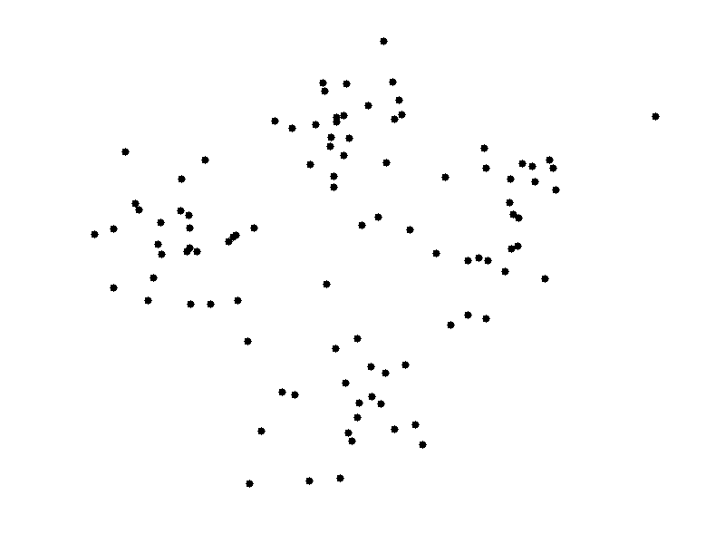
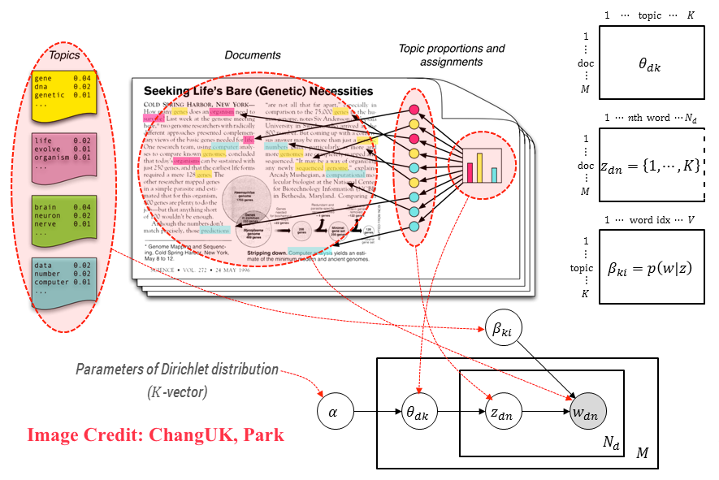

```{r, include = FALSE}
library(ggplot2)
library(tidyverse)
knitr::opts_chunk$set(cache = TRUE, fig.align = 'center')

```


## Outline

</br>

* Introduction

* Hypothesis testing
    
* Exploratory Data Analysis

* Topic Modeling 

* Questions


# Introduction

## Self-introduction

<section>

<div style="float: right; width: 25%; height: 60%; margin-left: 5%">
</br>


</br>

</div>


<div style="float: left; width: 70%; height: 60%;">

* I am a PhD student in [ICME](https://icme.stanford.edu/) 

* My research focuses on developing statistical methods for high dimensional 
data which take account of **non-uniform data density and variance**.

* I teach a short (4 weeks) introductory R course: 
[https://cme195.github.io/](https://cme195.github.io/)

* In our lab, we use **microbiome data** for inspiration, i.e.
we look for problems that this data generates and try to solve them.

</div>
</section>


## Digital Humanities?

<center>

</center>

<small2>
Generated with Voyant and Wikipedia entry for Digital 
Humanities.
</small2>

<small2>
*DH now encompasses a wide range of methods and practices: visualizations 
of large image sets, 3D modeling of historical artifacts, 'born digital' 
dissertations, hashtag activism and the analysis thereof, alternate reality 
games, mobile makerspaces, and more.* [^1]


[^1]: [Gold, Matthew K., and Lauren F. Klein, eds. Debates in the Digital 
Humanities 2016. Minneapolis; London: University of Minnesota Press, 2016.](http://www.jstor.org/stable/10.5749/j.ctt1cn6thb)

</small2>


## Statistics


<div style="float: left; width: 30%; font-size: 0.8em;">


</div>

<div style="float: right; width: 65%; margin-left:5%;">


* Helps you explore patterns hidden in your data making it easier 
to draw insights.

* Provides formal frameworks for data analysis and for modeling.

* Gives you means to tests your hypotheses ane evaluate significance of 
your findings.

</div>


## Buzz words exercise

## Books and classes


* Books:
    - [Introduction to Statistical Learning](http://www-bcf.usc.edu/~gareth/ISL/)
     <small2> by James, Witten, Hastie \& Tibshirani </small2>
    - [Elements of Statistical Learning](https://web.stanford.edu/~hastie/ElemStatLearn/)
     <small2> by Hasties, Tibshirani \& Friedman </small2>
    - [R for Data Science](http://r4ds.had.co.nz/)  <small2> by Grolemind and Wickham </small2>
    - [Statistical Rethinking](http://xcelab.net/rm/statistical-rethinking/) 
     <small2> by McElreath on Bayesian statistics </small2>
    
* Classes:
    - STATS 116: Theory of Probability
    - STATS 200: Introduction to Statistical Inference
    - STATS 202: Data Mining and Analysis
    - STATS 206: Applied Multivariate Analysis
    - STATS 208: Introduction to the Bootstrap
    - STATS 216: Introduction to Statistical Learning


## Getting Free Help on Campus

</br>

* [[Stats Consulting]](https://statistics.stanford.edu/resources/consulting)
Advice on experimental design, model fitting, data analysis and interpretation 
of results etc.
  


* [[C2 Consulting]](https://icme.stanford.edu/resources/computational-consulting-c2)
Computational questions on optimization, implementation, software libraries, 
computer clusters, code speed-up, parallelisation, etc.
  
  </br>
  
  <small2>https://statistics.stanford.edu/resources/consulting</small2>

  <small2> https://icme.stanford.edu/resources/computational-consulting-c2 </small2>


# Hypothesis testing

## Coincidences

Consider an example of a seemingly extremely unlikely event:

> - A woman won the New Jersey Lottery twice in four months.
The event was widely reported as an amazing coincidence that beat **odds 
of one in 17 trillion**.

> -  However, the reported probability is a chance of the event happening
to **a specific person**.

> -  A probability one should ask about is the one of this event happening
to ANYONE in the US.

> - ... and this one is just **one in 30**.

## Law of TRULY large numbers

>  Given a sample size large enough, any outrageous thing is likely to happen 
[^2]

[^2]: Persi Diaconis & Frederick Mosteller (2012) Methods for Studying 
Coincidences, Journal of the American Statistical Association, 
84:408, 853-861, DOI: 10.1080/01621459.1989.10478847


**Blade of grass paradox ** (Diaconis 1990)

> If  you  were  to  stand  in  a  field  and  reach  down  to  touch  a  blade 
of  grass,  thereare  millions  of  grass  blades  that  you  might  touch.  
But  you  will,  in  fact,  touch one  of  them.  The  a  priori  fact  that  
the  blade  you  touch  will  be  any  particular one  has  an  extremely  tiny  
probability,  but  such  an  occurrence  must  take  place if  you  are  going  
to  touch  a  blade  of  grass.


## Reproducible research

> *  The truth is, there are tons ways to model the data. Then, there
are usually dozens of parameters associated with each model. 

> *  Instead of worrying about whether you made a good choice all the time, 
just **do the best you can, be honest and report everything!**
>    + Never delete raw data.
>    + Document all decisions.
>    + Save your code and intermediate results.
>    + Share your program AND documentation with the public.


## Hypothesis testing can be used to answer questions

> * Is the measured quantity equal to/higher/lower than a given threshold?
>    + e.g. is the cooccurrence of a pair of words is higher than a certain 
level?

> * Is there a significant difference between two groups of observations? 
>    + e.g. is the frequency of certain words higher in one literary genre
then another? 

> * Are the values two two quantities related?
>    + e.g. is there a correlation between tweet sentiment from certain
people and a stocks market movement?


## Steps required for hypothesis testing

> 1. Define the null and the alternative hypothesis.

> 2. Choose a level of significance $\alpha$.

> 3. Define and compute a test statistic.

> 4. Compute a p-value.

> 5. Decide whether to reject the null hypothesis by comparing 
p-value to $\alpha$.

> 6. Draw conclusion from the test.

## Null and alternative hypotheses

</br>

**A null hypothesis ($H_0$)**: A statement assumed to be true unless it can be 
shown incorrect beyond a reasonable doubt. This is something one usually 
attempts to disprove or discredit. 

</br>

**The alternate hypothesis ($H_1$)**: A claim that is contradictory to 
H0 and what we conclude when we reject H0.


##

> H0 and H1 are on purporse set up to be contradictory, so that one **can 
collect and examine data to decide if there is enough evidence to reject 
the null hypothesis or not**. 

<center>


</center>

## Student's t-test

<div style="float: left; width: 70%;">

* William Gosset (1908), a chemist at **the Guiness brewery**.

* Published in Biometrika under a **pseudonym Student**.

* Used to select best yielding varieties of barley.

* Now, is a widely adopted method for hypothesis testing.

</div>

<div style="float: right; width: 25%; margin-left: 5%;">


</div>

## One sample t-test

**Test the null hypothesis:** the mean of data is equal to $\mu_0$

\[
H_0: \mu = \mu_0 \\
H_a: \mu \ne \mu_0 
\]

Test statistic: 

\[
t = \frac{\bar X - \mu_0}{s / \sqrt{n}}
\]

where $\bar X$ is tha sample average, $s$ is the sample standard deviation,
and $n$ is the number of observations.


## Two sample (Welch's) t-test

**Test the null hypothesis:** the mean is equal in both groups

\[
H_0: \mu_1 = \mu_2 \\
H_a: \mu_1 \ne \mu_2
\]

Test statistic: 

\[
t = \frac{\bar X_1 - \bar X_2}{\sqrt{s_1^2/n_1 + s_2^2/n_2}}
\]

Welch's t-test used when the two population variances are not assumed to
be equal.

## Assumptions of t-test

* the sample mean -- $\bar X$ -- is normally distributed, 
* the sample variance -- $s^2$ -- follows a scaled $\chi^2$ distribution
* $\bar X$ and $s^2$ are independent

**Note that:**

Normality of individual observations $X_1, X_2, \dots, X_n$ is not required.

**Central limit theorem:**

sample means of moderately large samples are often 
well-approximated by a normal distribution even if the data are not 
normally distributed


## p-value


<div style="float: left; width: 40%">

t-distribution with appropriate degrees of freedom


</div>

<div style="float: right; width: 55%; margin-left: 5%">

> - p-value is **a probability of observing the recorded event or
a *more extreme occurrence*, assuming that $H_0$ is true**.

> - Small p-value indicates strong evidence against 
$H_0$. You should reject $H_0$.

> - Large p-value indicates weak evidence against $H_0$. 
You CANNOT reject $H_0$.


</div>


## p-value 

p-value can be written as $P[\text{data} \mid H_0]$. 

Note that:

$$P[\text{data}  \; \mid \; \text{hypothesis} ] \ne P[\text{hypothesis}  \; \mid \; \text{data}]$$

</br>


**This is the reason why p-values should NOT be used for ranking or scoring
different hypotheses**. 

p-values can only be used to reject a null hypothesis. 

Also, null hypothesis cannot be proven true, **you can only fail to reject it**.


## Example: one sample test

* A built-in dataset, `mtcars`,  that comes from a 1974 issue of Motor Trends 
magazine. 

```{r}
data("mtcars")
head(mtcars)
```

* rows correspond to car models,
* column are car attributes: miles per gallon, number of 
cylinders, displacement, transmission etc.

## Testing 'mpg' equal to a value

<div class = "left">
Is the mean fuel efficiency (mpg) in the cars in `mtcars` 
statistically equal to 25? 

</br>
**Two-sided test**

\[H_0: \mu = 25 \\
H_a: \mu \ne 25\]
where $\mu$ is the mean mpg of cars in the dataset
</div>

<div class = "right">

</div>


##
```{r}
mtcars$mpg
tt <- t.test(x = mtcars$mpg, mu = 25, alternative = "two.sided")
tt
```


## Testing 'mpg' smaller than a value

<div class = "left">

Is the mean fuel efficiency (mpg) in the cars in `mtcars` 
statistically less than 25? 

</br>
**One-sided test**

\[H_0: \mu = 25 \\
H_a: \mu < 25\]
where $\mu$ is the mean mpg of cars in the dataset
</div>

<div class = "right">

</div>

##

```{r}
tt <- t.test(x = mtcars$mpg, mu = 25, alternative = "less")
tt
```


## Sign test

If $n$ is small and $\bar X$ is not normal, one can use distribution-free,
non-parametric sign-test.

\[
H_0: \text{median} = \mu_0 \\
H_a: \text{median} > \mu_0
\]

$V$ = Number of times $X_i - \mu_0 > 0$

$V \sim \text{Binomial}(n, p = 1/2)$

The probability of observed $V$ under this distribution is now the p-value.

## Bootstrap and permtation two-sample test


If sample means normality is satisfied, one can use
permutation or bootstrap method to estimate the distribution of the 
test-statistic.

**Permutation:** rearranging of the group labels. 


<!---Compute the test statistic, $t_i$, for data under a permutation $i$ of 
the group assignments -->

The p-value is the proportion of sampled data permutations where 
the the test statistic $t_i$ was greater than or equal to the test statistics
corresponding to the original (unpermuted) data $t$.

**Bootstrap:** assign samples to each group by resampling with replacement
Useful, when datasets are large.


<!----------------------------------------------------------------------------->

# Exploratory Data Analysis 

## Unsupervised Learning

* Inferring latent/hidden patterns and structures in unlabeled data 
(no class-assignents).
* Understanding the relationships between features or 
among observations.
* No special variables such as response or output variables, which 
need to be predicted.
* There are no prespecified classes or groups of observations.
Ther is only X and no Y.


## Dimensionality Reduction and Visualization

> * Most of **real life datasets are now high-dimensional** e.g. 
text corpora, user internet activity, genetic sequencing data etc.
> * DR or feature extraction methods **can reduce the number of variables.**
> * The methods can be used to:
>    + compress the data
>    + remove redundant features and noise
>    + increase accuracy of learning methods by avoiding over-fitting and
    [the curse of dimensionality](http://statweb.stanford.edu/~donoho/Lectures/AMS2000/Curses.pdf) 
>* Common methods for dimensionality reduction include: PCA, CA, ICA, MDS, 
Isomaps, Laplacian Eigenmaps, tSNE.

## Voyant ScatterPlot = PCA or CA on word frequencies

```{r fig.width=10, fig.height=7,echo=FALSE}
library(png)
library(grid)
img <- readPNG("./figs/digital_humanities_scatterplot.png")
grid.raster(img)
```


## Principal Component Analysis (PCA)

<div style="float: left; width: 45%; height: 70%">


</div>

<div style="float: left; width: 51%; height: 70%">

</div>

Source: [ESL Chapter 14](https://web.stanford.edu/~hastie/ElemStatLearn/)


## Maximal Variance Projection

</br>

* For $X\in \mathbb{R}^{n \times p}$, $\tilde X  = (X - \bar X)$ is a centered 
data matrix. 

* PCA is **an eigenvalue decomposition of the sample covariance matrix**:

$$C = \frac{1}{n-1} \tilde X ^T \tilde X = \frac{1}{n-1} V \Sigma^2 V^T$$ 

* or (equivalently) **a singular value decomposition (SVD)** of $\tilde X$ itself:

$$\tilde X = U \Sigma V^T $$

In the above $U$ and $V$ are orthodgonal matrices and 
$\Sigma$ is a diagonal matrix.

##

* The projection of X into the space of principal components is 
called a **component scores**:

$$S = \tilde{X} V = U\Sigma V^T V = U\Sigma$$

</br>

* The weights of the variables in the PCA space, $L = V\Sigma$, are 
called **loadings**.


## Dimensionality reduction with PCA

> * PCA finds **a set of uncorrelated** directions (components)
that are **linear combinations of the original data**.

> * These components sequentially explain most of the variation 
remaining subsequently in the data.

> * Reduction occurs when the top $k \ll \min(p, n)$ components are retained.

> * The $k$-dimensional approximation of $X$ is:

> * $$S_k = U_k D_k$$

> * where $U_k$ is a matrix with $k$ first columns of $U$ and 
$D_k$ is the diagonal matrix containing first $q$
diagonal terms of $D$


## What does it all mean?

* You can use **eiganvalues and eigenvectors** generated by PCA to learn the
structure of your data.

* Most commonly, people use **scree plots, as well as feature plots, sample 
plots and biplots** to visualize PCA results.

* Feature and sample plots are self-explanatory, we will explain
what scree plots and biplots are.

## Scree plot

<div style="float: left; width: 70%">
* Eigenvalues are used to compute the amount of *variance explained*.
* A scree plot can be used to choose how many components to retain for further
analysis.

* Choose the smallest number of PCs that explain a sizable amount of 
variation in the data.

* Look for **"elbows"** in the scree plots i.e. points at which **the 
proportion of variance explained** by subsequent PCs drops off. 

</div>


<div style="float: right; width: 30%">

</div>


## Biplot

Both samples and variables displayed in the same plot.

```{r fig.width=8, fig.height=6,echo=FALSE}
img <- readPNG("./figs/biplot-crime.png")
grid.raster(img)
```


## The US crime rates dataset

The built in dataset includes information on violent crime rates
in the US in 1975.

```{r}
head(USArrests)
```

## PCA in R

* In R, the function `prcomp()` can be used to perform PCA. 
* `prcomp()` is faster and preferred method over `princomp()`; it is a PCA 
implementation based on SVD.

```{r}
pca.res <- prcomp(USArrests, scale = TRUE)
```

* The output of `prcomp()` is a list containing:

```{r}
names(pca.res)
```

##

```{r fig.height=6, fig.width=6}
biplot(pca.res, scale=1, cex = 0.8)
```


## Correspondence Analysis (CA)


>* Applies to data with measurements **in same scale and units**.

>* Unlike PCA, CA is often used  for categorical rather than continuous data.

>* Specifically,CA is performed on a **contingency tables** -- data tables with
frequency distribution.

>* Computations are the similar but slightly different than in PCA, 
and involve an initial *data normalizion step*.


## Correspondence Analysis Computations

Input: 

contingency table $C \in \mathbb{R}^{n \times p}$ e.g. word frequencies
in documents

Data transformation:

$$
M  = \frac{1}{s}C - w_{row}w_{col}^T
$$

where $s = \text{sum all entries in C}$, 

and

\[{\vec w}_{row} = \frac{1}{s} C\mathbf{1}, \\
{\vec w}_{col}^T = \frac{1}{s} \mathbf{1}^TC\]

## Generalized SVD on $M$

\[M = U \Sigma V^T\]

with constraints:

\[U^T W_{row} U = I \; \text{ and } \; V^T W_{col} V= I\]

where $W_{row}$ and $W_{col}$ are diagonal matrices whose entries are 
${\vec w}_{row}$, ${\vec w}_{col}$, defined in the previous slide.

The coordinates for rows and columns in the CA projection are then:

\[
F_n = W_n U \Sigma \\
F_p = W_p V \Sigma
\]


# Break for an exercise


# Clustering


## Cluster Analysis

* **Clustering is an exploratory technique** which can 
**discover hidden groups** that are important for understanding the data.
* Groupings are determined from the data itself, 
**without any prior knowledge about labels or classes**.
* There are the clustering methods available; a lot of them have an R 
implementaion available on 
[CRAN](https://cran.r-project.org/web/views/Cluster.html).

<div style="text-align: center">

</div>

##

* To cluster the data we need a **measure of similarity** or
**dissimilarity** between a pair of observations, e.g.  an Euclidean distance.

<div style="text-align: center; height: 75%">

</div>

## k-means

* k-means is a simple and fast **iterative relocation method** 
for clustering data into $k$ distinct non-overlapping groups. 
* The algorithm minimizes the variation within each cluster.

<div style="height: 30%; width: 50%; align: center">


Source: [link](http://shabal.in/visuals/kmeans/3.html)
</div>

## k-means drawbacks

* **The number clusters $k$ must be prespecified** (before clustering).
* The method is stochastic, and involves **random initialization of
cluster centers**.
* This means that each time the algorithm is run, the results obtained
can be different.

The number of clusters, $k$, should be chosen using statistics such as:

* Gap Statistic [link](http://www.web.stanford.edu/~hastie/Papers/gap.pdf)
* Silhouette statistic [link](https://en.wikipedia.org/wiki/Silhouette_(clustering))
* Calinski-Harbasz index [link](http://www.biomedcentral.com/content/supplementary/1477-5956-9-30-S4.PDF)


## Image segmentation

* One of the application of k-means clustering is 
[**image segmentation**](https://www.r-bloggers.com/r-k-means-clustering-on-an-image/).

* Here we use a picture of a field of tulips in the Netherlands
downloaded from [here]("http://www.infohostels.com/immagini/news/2179.jpg").

<div style="text-align: center; height: 75%">

</div>

## Importing image to R

```{r}
library(jpeg)
img <- readJPEG("./figs/Image.jpg") 
(imgDm <- dim(img))
```

* The image is a 3D array, so we will convert it to a data frame.
* Each row of the data frame should correspond a single pixel. 
* The columns should include the pixel location (`x` and `y`), 
and the pixel intensity in red, green, and blue ( `R`, `G`, `B`).

```{r}
# Assign RGB channels to data frame
imgRGB <- data.frame(
  x = rep(1:imgDm[2], each = imgDm[1]),
  y = rep(imgDm[1]:1, imgDm[2]),
  R = as.vector(img[,,1]),
  G = as.vector(img[,,2]),
  B = as.vector(img[,,3])
)
```


## k-means in R

* Each pixel is a datapoint in 3D specifying the intensity in each of 
the three "R", "G", "B" channels, which determines the pixel's color.

```{r}
head(imgRGB, 3)
```


* We use k-means to cluster the pixels $k$ into color groups (clusters). 

```{r}
set.seed(43658) # Set seed as k-means involves a random initialization
k <- 2
kmeans.2clust <- kmeans(imgRGB[, c("R", "G", "B")], centers = k)
names(kmeans.2clust)
```


##

```{r}
# k cluster centers
kmeans.2clust$centers
# The centers correspond to the following colors:
rgb(kmeans.2clust$centers)
# Cluster assignment of the first 10 pixels
head(kmeans.2clust$cluster, 10)
# Convert cluster assignment lables to cluster colors
kmeans.2colors <- rgb(kmeans.2clust$centers[kmeans.2clust$cluster, ])
head(kmeans.2colors, 10)
```


##

```{r, fig.width = 10, fig.heigh = 6}
ggplot(data = imgRGB, aes(x = x, y = y)) + 
  geom_point(colour = kmeans.2colors) +
  labs(title = paste("k-Means Clustering with", k, "clusters (colors)")) +
  xlab("x") + ylab("y") + theme_bw()
```

##

Now, increasing the number of clusters to 6:

```{r, echo = FALSE}
set.seed(348675)
kmeans.6clust <- kmeans(imgRGB[, c("R", "G", "B")], centers = 6)
kmeans.6colors <- rgb(kmeans.6clust$centers[kmeans.6clust$cluster, ])
```

```{r, echo = FALSE, fig.width = 10, fig.heigh = 6}
ggplot(data = imgRGB, aes(x = x, y = y)) + 
  geom_point(colour = kmeans.6colors) +
  labs(title = paste("k-Means Clustering with 6 clusters (colors)")) +
  xlab("x") + ylab("y") + theme_bw()
```


## Hierarchical clustering

<div style="height:10%; width:100%; float: center">

</div>
<small> Alexander Calder's mobile </small>

* If it's difficult (or if you simply
don't want) to choose the number of clusters ahead,
you can do **hierarchical clustering**.\

##

>* Hierarchical clustering can be performed using **agglomerative** (bottom-up)
or **divisive** (top-down) approach.

>* The method requires a choice of **a pairwise distance metric and a rule
of how to merge or divide clusters**.

>* The output of the method can be represented as a graphical tree-based 
representation of the data, called a **dendogram**.

>* By inspecting the tree, you can decide where to set the cutoff for 
observation grouping.

>* There are also static and dynamic tree cutting algorithms.

##

<div style="float: left; width: 50%; height: 100%">


</div>

<div style="float: left; width: 50%; height: 100%">

</div>


## Hierarchical clustering algorithm


Source: ISL

## 

Results for hierarchical clustering differ depending on the choice of:

* A distance metric used for pairs of observations, e.g. Euclidean (L2), 
Manhattan (L1), Jaccard (Binary),
[etc](http://dataaspirant.com/2015/04/11/five-most-popular-similarity-measures-implementation-in-python/)

* The rule used for grouping clusters that are already generated, e.g. 
minimum, maximum, average, or centroid cluster linkages. 

</br>

<div style="text-align: center; height: 75%">

</div>

##
Different ways to compute dissimilarity between 2 clusters:


# Topic modeling

## Latent Dirichlet Allocation (LDA)

LDA is a generative model, which assumes that:

* Each observation is a mixtures of topics.

* Each topic is a mixture of tokens.

In textual analysis, topics might be themes e.g. "entertainment", "politics",
or "sports". 

Observations can be documents or parts of documents.

Tokens are words.

## LDA



Source: [medium](https://medium.com/kifi-engineering/reactive-lda-library-d495ed2a6342)

## LDA model

Let $D$ be the number of documents, $V$ the size of the vocabulary,
and $K$ the number of underlying topics.

\[
\boldsymbol\gamma_{d = 1, \dots, D} \sim \text{Dirichlet}(\boldsymbol\alpha) \\
\boldsymbol\beta_{k = 1, \dots, K} \sim \text{Dirichlet}(\boldsymbol\pi)\\
\]

$\text{ for all } d = 1, \dots, D \text{ and } \; j \in N_d$
\[
z_{dj} \sim \text{Multinomial}_K(\boldsymbol\gamma_d)\\
w_{dj} \sim \text{Multinomial}_V(\boldsymbol\beta_{z_{dj}})
\]


where **hyperparameters** satisfy 
$\alpha_k, \; \pi_v > 0$,  $\sum_{k = 1}^K\alpha_k = 1$, 
and $\sum_{v = 1 }^{V}\pi_{v} = 1$.


Usually, $\boldsymbol\alpha$, and $\boldsymbol\pi$ are chosen to have equal
entries, i.e. the topic and words distribution are assumed to have
even priors.


## Bayesian Inference for LDA parameters

* Since, LDA is a full genrative model, we can write a joint
probability for the entire model.

* Hyper parameters $\boldsymbol \alpha, \boldsymbol \pi$ can be integrated 
out.

* The main goal is to estimate the **posterior distributions** of 
$\boldsymbol \gamma_d$ for each document and $\boldsymbol\beta_k$ for
each topic.

* Estimation is usually done via Gibbs sampling or variational Bayes
approximation.


## 

```{r fig.width=10, fig.height=7,echo=FALSE}
library(grid)
img <- readPNG("./figs/LDA_beta.png")
grid.raster(img)
```


# Random Forest

## Random Forest

* Random Forest is **an ensemble learning method based on classification 
and regression trees, CART,** proposed by 
[Breinman](http://link.springer.com/article/10.1023/A:1010933404324) in 2001.
* RF can be used to perform **both classification and regression**.
* RF models are robust as they **combine predictions calculated from a large 
number of decision trees (a forest).**
* Details on RF can be found in Chapter 8 of 
[ISL](http://www-bcf.usc.edu/~gareth/ISL/ISLR%20Sixth%20Printing.pdf)
and Chapter 15 [ESL](http://statweb.stanford.edu/~tibs/ElemStatLearn/); 
also a good write-up can also be found 
[here](http://www.bios.unc.edu/~dzeng/BIOS740/randomforest.pdf)

## Decision trees

* Cool visualization explaining what decision trees are:
[link](http://www.r2d3.us/visual-intro-to-machine-learning-part-1/)

* Decision tree on classification of Titanic Survivors:

```{r, message=FALSE, warning=FALSE, echo=FALSE, fig.width=8, fig.height=6, fig.align='center'}
library(rpart)
library(rpart.plot)
data(ptitanic)
tree <- rpart(survived ~ ., data=ptitanic, cp=.02)
cols <- c("darkred", "green4")[tree$frame$yval] # green if survived
prp(tree, tweak=1.4, extra=106, under=TRUE, branch=.5, faclen=0,
    ge=" > ", eq=" ", split.prefix="is ", split.suffix="?",
    col=cols, border.col=cols, trace=FALSE)
```

## Tree bagging Algorithm

Suppse we have an input data matrix, $X \in \mathbb{R}^{N \times p}$ and a
response vector, $Y \in \mathbb{R}^N$.

<div style="color:#00008f">
For b = 1, 2, ..., B:

$\quad$  1. Generate a random subset of the data $(X_b, Y_b)$ contatining $n < N$ 
\vspace{-10mm}

$\quad \;$ observations sampled with replacement.

$\quad$  2. Train a decision tree $T_b$ on $(X_b, Y_b)$

$\quad$  3. Predict the outcome for $N-n\;$ unseen (complement) samples $(X_b', Y_b')$

Afterwards, combine predictions from all decision trees and compute the average 
predicted outcome .
</div>

</br>

**Averaging over a collection of decision trees makes the predictions
more stable.**


## Decision trees for bootrap samples

<div style="text-align: center">


Source: [Chapter 8 ESL](https://web.stanford.edu/~hastie/ElemStatLearn/)
</div>


## Random Forest Characteristics

* Random forests differ in only one way from tree bagging: it uses a modified 
tree learning algorithm sometimes called **feature bagging**. 

* At each candidate split in the learning process, **only a random subset of 
the features is included in a pool** from which the variables can be selected
for splitting the branch.

* Introducing **randomness** into the candidate splitting variables,
**reduces correlation between the generated trees.** 

##

<div style="text-align: center">

</div>

##

<div style="text-align: center">


Source: [link](http://www.slideshare.net/satnam74/india-software-developers-conference-2013-bangalore)
</div>


## Model Accuracy

* When dealing with a supervised learning task, always 
**evaluate your model's performance on a test set**

* **Test set** is a collection of observations, which is set aside and not seen 
by the prediction method at all.

* In case of RF, performance on train and test set should be similar,
beacause RF minimizes training errors on observations unseen by the tree.  

* Confusion matrix can be used to asses the model accuracy.

* RF also gives 'importance measures' for each predictor (feature).


<!------------------------------------------------

# Prediction

## Supervised Learing

## Linear Regression (continuous)

## Logistic Regression (discrete)

## Decision Trees


## Network Analysis

----------------------------->
